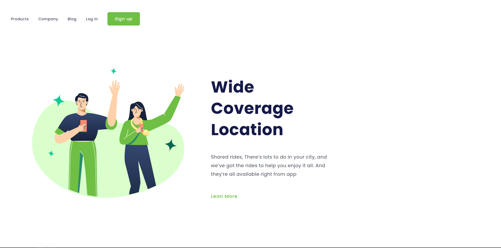

# 🌍 Wide Coverage Location

## 📝 Descrição  
Este projeto foi criado para praticar **HTML5** e **CSS3**, com foco em **responsividade** e **layout moderno**.  
O objetivo é treinar o posicionamento de elementos e o uso de **Flexbox**, além de reforçar o conceito de **design limpo e intuitivo**.

O site simula uma *landing page* com foco em uma aplicação de **mobilidade urbana**, destacando a cobertura e praticidade do serviço.

---

## 🧠 Tecnologias utilizadas  
- HTML5  
- CSS3 (Flexbox, Media Queries)  

---

## 🎨 Layout do projeto  


---

## 🚀 Como visualizar  
1. Baixe ou clone o repositório:  
   ```bash
   git clone https://github.com/Hemmercamp/Wide-Coverage.git
   ```
2. Abra o arquivo `index.html` no navegador.

---

## 💡 Autor  
Desenvolvido por **Hemmercamp** 🧑‍💻  
📚 Projeto de prática do curso **DevClub**.
